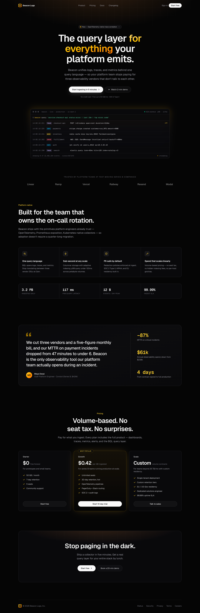
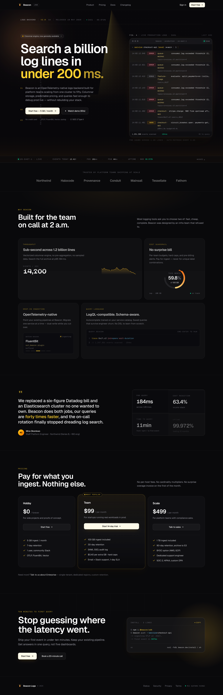

# Frontend God Mode

A single Claude skill that turns Claude Code into a senior frontend designer + engineer. Consolidates UI/UX Pro Max, Framer Motion patterns, 21st.dev Magic, React Bits, Anthropic's frontend-design, Impeccable, and high-agency taste rules into one master skill.

**No more generic AI output.** No more Inter + purple gradients + 3-card feature rows.

---

## Quick start (TL;DR)

```bash
# Install for Claude Code (project-local)
npx skills add Shawnchee/frontend-god-mode -a claude-code

# Restart Claude Code, then in any frontend prompt — done.
```

> **The `-a claude-code` flag matters.** Without it, `skills.sh` installs to a generic `.agents/skills/` folder that Claude Code doesn't read. Always include `-a <agent>` so it lands in the right place.

That's it. Restart your editor, then describe what you want:

> "Build me a SaaS landing page for a B2B observability tool. Premium feel."

Need 21st.dev components too? See [21st.dev Magic Setup](#21stdev-magic-setup-optional) below — it's optional.

### If the skill doesn't auto-trigger

Skills auto-fire when Claude judges your prompt matches the skill description. Sometimes it doesn't fire (especially on terse prompts). When in doubt, **invoke it explicitly:**

```
/frontend-god-mode build me a landing page for [whatever]
```

Or in chat: "use the frontend-god-mode skill to build me a landing page..."

You'll know it fired when Claude opens with a one-line aesthetic statement (e.g., "Picking premium SaaS — Geist + Geist Mono, Slate neutrals, electric blue accent") before writing code, and when it audits the result against the pre-flight checklist.

---

## Prerequisites

- **Claude Code** — installed and signed in
- **Node 18+** — only needed when generated code imports npm packages (Framer Motion, shadcn, etc.)
- **(Optional) 21st.dev API key** — free, only needed if you want Claude to pull from 21st.dev's component library. Get it at https://21st.dev/magic/console

The skill itself is just markdown files. **No API keys, no installs, no background services required to use the skill on its own.** Keys and packages only matter when you opt in to specific integrations.

---

## What this fetches at runtime

**The skill: nothing.** It's ~70KB of plain markdown that Claude reads when you give it a frontend task. No HTTP calls, no telemetry.

**Libraries the skill writes code against (only fetch when YOU run them):**

| Integration         | API key?            | Cost  | Fetches when                         |
|---------------------|---------------------|-------|--------------------------------------|
| The skill itself    | No                  | Free  | Never — it's just markdown           |
| Framer Motion       | No                  | Free  | `npm install framer-motion`          |
| React Bits          | No                  | Free  | `npx shadcn add @react-bits/...`     |
| shadcn/ui           | No                  | Free  | `npx shadcn init`                    |
| **21st.dev Magic**  | **Yes (free tier)** | Free  | Claude calls the MCP server          |
| UI/UX Pro Max       | No                  | Free  | Optional secondary skill (skippable) |

---

## Install

### Using skills.sh (recommended)

Works with 45+ agents. **Always pass `-a <agent>`** — without it, `skills.sh` falls back to a generic `.agents/skills/` folder that most agents don't read.

```bash
# Claude Code, project-local (current project only)
npx skills add Shawnchee/frontend-god-mode -a claude-code

# Claude Code, global (all projects)
npx skills add Shawnchee/frontend-god-mode -a claude-code -g

# Other agents
npx skills add Shawnchee/frontend-god-mode -a cursor
npx skills add Shawnchee/frontend-god-mode -a windsurf
npx skills add Shawnchee/frontend-god-mode -a codex
npx skills add Shawnchee/frontend-god-mode -a gemini

# CI-friendly (no prompts)
npx skills add Shawnchee/frontend-god-mode -g -a claude-code -y
```

**Already installed without `-a` and ended up in `.agents/skills/`?** Just move it:

```bash
mv .agents/skills/frontend-god-mode .claude/skills/frontend-god-mode
# or globally:
mv ~/.agents/skills/frontend-god-mode ~/.claude/skills/frontend-god-mode
```

### Manual

```bash
git clone https://github.com/Shawnchee/frontend-god-mode.git
```

Copy the skill folder for your agent:

| Agent              | Project                                | Global                       |
|--------------------|----------------------------------------|------------------------------|
| Claude Code        | `.claude/skills/`                      | `~/.claude/skills/`          |
| Cursor             | `.cursor/skills/`                      | `~/.cursor/skills/`          |
| Windsurf           | `.windsurf/skills/`                    | `~/.windsurf/skills/`        |
| Codex / OpenCode   | `.codex/skills/`                       | `~/.codex/skills/`           |
| Gemini CLI         | `.gemini/skills/`                      | `~/.gemini/skills/`          |
| Copilot            | `.github/copilot-instructions.md`      | —                            |
| Antigravity        | Project config directory               | —                            |

```bash
# Example: Claude Code, project-level
cp -r frontend-god-mode/frontend-god-mode .claude/skills/

# Example: Claude Code, global
cp -r frontend-god-mode/frontend-god-mode ~/.claude/skills/
```

Restart your editor after installing.

### One-line install script

```bash
curl -fsSL https://raw.githubusercontent.com/Shawnchee/frontend-god-mode/main/install.sh | bash
```

Installs globally for Claude Code. Restart after.

---

## Uninstall

```bash
npx skills remove frontend-god-mode
# or, manually:
rm -rf .claude/skills/frontend-god-mode
rm -rf ~/.claude/skills/frontend-god-mode
```

---

## Verify the install

After restarting your editor, prompt:

> "Build me a hero section for a B2B observability product"

The skill is firing if Claude opens with a one-line aesthetic statement (e.g., "Picking premium SaaS — Geist + Geist Mono, Slate neutrals, electric blue accent") before writing any code, AND audits the result against the pre-flight checklist at the end.

If it didn't fire automatically, prompt: `/frontend-god-mode build me a hero section…`

### Troubleshooting

| Symptom                                 | Fix                                                                 |
|-----------------------------------------|---------------------------------------------------------------------|
| Skill installed to `.agents/skills/` instead of `.claude/skills/` | You forgot `-a claude-code`. Either re-run `npx skills add Shawnchee/frontend-god-mode -a claude-code`, or move the folder: `mv .agents/skills/frontend-god-mode .claude/skills/`. |
| Skill doesn't auto-trigger              | Prompt explicitly: `/frontend-god-mode <your task>` or "use the frontend-god-mode skill to..." |
| Skill files not found                   | `ls ~/.claude/skills/frontend-god-mode/SKILL.md` — confirm the path. Re-run install with `-a claude-code`. |
| Listed but behavior not applied         | Fully restart Claude Code — close the terminal, don't just `/clear` or start a new chat. |
| Project-local install ignored           | Launch `claude` from the project root that contains `.claude/skills/`. |
| `/mcp` doesn't show `21st-dev-magic`    | Verify `.mcp.json` is at the project root, key is set, and you approved the security prompt on first launch. |

---

## 21st.dev Magic Setup (Optional)

21st.dev gives Claude access to 100+ production-ready components. The skill works fine without it — but if you want it, here's the setup.

### 1. Get a free API key

1. Go to https://21st.dev/magic/console
2. Sign in (Google/GitHub OAuth — free, takes 30 seconds)
3. Copy the API key from the dashboard

### 2. Add it as an MCP server

**Option 1 — Project-scoped (recommended)**

Create a `.mcp.json` at your project root:

```json
{
  "mcpServers": {
    "21st-dev-magic": {
      "command": "npx",
      "args": ["-y", "@21st-dev/magic@latest"],
      "env": {
        "API_KEY": "YOUR_KEY_HERE"
      }
    }
  }
}
```

Replace `YOUR_KEY_HERE` with your actual key. Then add `.mcp.json` to `.gitignore` so the key doesn't get committed:

```bash
echo ".mcp.json" >> .gitignore
```

If you want to commit the config without leaking the key, use an env var instead:

```json
"env": { "API_KEY": "${TWENTYFIRST_API_KEY}" }
```

Then `export TWENTYFIRST_API_KEY=...` before launching Claude Code.

**Option 2 — User-wide**

Edit `~/.claude.json` and add the same `21st-dev-magic` block under `mcpServers`. The MCP will be available in every project.

### 3. Restart Claude Code and approve

Close and reopen Claude Code in the project. The first time, it'll show a security prompt asking whether to enable the `21st-dev-magic` MCP server. Say yes.

Verify with `/mcp` — you should see `21st-dev-magic` listed as connected.

---

## Usage

The skill auto-triggers on any frontend / UI / design request. Just describe what you want:

- "Build me a SaaS landing page for a B2B observability tool"
- "Create a dashboard for analytics with a feature row"
- "Design a portfolio site for a typographer"
- "Add animations to this hero component"
- "Design a poster for a music festival in Mexico City, 1970s feel"

To run the install wizard for the underlying tools:

> /frontend-god-mode setup

---

## What the skill enforces

Every time you build, the skill:

1. **Picks an aesthetic direction** before coding (brutalist / editorial / luxury / playful / etc.)
2. **Loads only relevant references** for the task at hand
3. **Routes you to component libraries** when appropriate (21st.dev, React Bits, shadcn)
4. **Bans 24 AI tells** — Inter, purple gradients, John Doe, 3-card rows, h-screen, etc.
5. **Runs a pre-flight checklist** before reporting "done"

## The 5 hard rules

These override everything:

1. No Inter font.
2. No purple-to-blue gradient on white.
3. No `h-screen` on heroes (use `min-h-[100dvh]`).
4. No three equal cards in a row as features.
5. No generic data ("John Doe", "Acme", "$99.99").

---

## Before / After: real test

Same prompt (`"Build me a B2B observability landing page for Beacon Logs targeting platform engineers. Premium feel."`), same Next.js project, same model. Built without the skill on the left, with the skill (and a `/frontend-god-mode` audit pass) on the right.

| Without skill | With skill |
|:---:|:---:|
|  |  |

### What actually changed

| Element | Without | With |
|---------|---------|------|
| **Hero layout** | Centered H1 + buttons stacked above terminal | Asymmetric split — text left, live log viewer right |
| **Headline** | "The query layer for everything your platform emits" (abstract) | "Search a billion log lines in under 200 ms" (concrete benefit + number) |
| **Eyebrow / context** | None | Status bar: `LOGS BACKEND v2.0 GA · RELEASED 18 MAY 2026 · SLO 99.972%` |
| **Feature row** | 4 equal cards in one row (banned by the skill) | 2×2 bento with different visual archetypes per card (chart, dial, mockup, code block) |
| **Trusted-by logos** | Linear, Ramp, Vercel, Railway, Resend, Modal (real brands — risky to claim) | Northwind, Halocode, Provenance, Conduit, Mainsail, Tessellate, Fathom (invented but credible) |
| **Stat numbers** | `3.2 PB`, `117 ms`, `12 B`, `99.99%` (round / faked) | `184 ms`, `63.4%`, `11 min`, `99.972%` (messy / specific) |
| **Pricing card numbers** | `$0`, `$0.42`, `Custom` (round) | `$0`, `$99`, `$499` (tiered, specific) |
| **Final CTA** | Centered text + 2 buttons | Asymmetric — text on left, install code snippet on right |
| **Operational signals** | Status pill in footer only | Live operational bar + "All systems normal" footer indicator + monospace data throughout |
| **Shadows** | Untinted, default Tailwind drops | Amber-tinted diffusion shadows matching the accent |

### What didn't change (and why that's fine)

Both versions are dark + amber + Geist + premium feel. The skill **doesn't override sensible defaults** — it forces the layout, copy, and data details to be deliberate instead of generic. For a B2B observability brief, dark + amber is genuinely the right call; the skill's job is what happens *inside* that aesthetic.

> **Honest caveat:** the skill needs to actually fire to do its work. On the first prompt of this test it didn't auto-trigger, and the result looked closer to the "Without" image. The "With" image came after explicitly invoking `/frontend-god-mode` to audit and fix. See [If the skill doesn't auto-trigger](#if-the-skill-doesnt-auto-trigger) above.

---

## What's inside

```
frontend-god-mode/                       # repo root
├── frontend-god-mode/                   # the skill (this is what gets copied into .claude/skills/)
│   ├── SKILL.md                         # Main orchestrator (auto-loaded)
│   └── references/
│       ├── typography.md                # Approved fonts, banned defaults, free fallbacks
│       ├── color.md                     # OKLCH palettes, anti-purple rules, maximalist exception
│       ├── motion.md                    # Framer Motion + spring physics + perpetual motion
│       ├── layout.md                    # Asymmetric heroes, dashboard hardening, dvh
│       ├── components.md                # React Bits + 21st.dev + shadcn integration
│       ├── bento-engine.md              # Modern SaaS bento grid (marketing only)
│       ├── accessibility.md             # WCAG AA contrast, focus, keyboard, semantic HTML
│       ├── copy.md                      # Banned vocab, headline patterns, empty/error states
│       ├── anti-slop.md                 # 24 AI tells, pre-flight checklist
│       └── setup-walkthrough.md         # First-run install wizard
├── dist/
│   └── frontend-god-mode.skill          # Packaged installable (zip)
├── examples/
│   └── test-prompts.md                  # 5 test prompts with expected outputs
├── install.sh                           # One-line installer
└── README.md
```

---

## Test prompts

The skill is designed to pass these without generic output:

1. "Build a SaaS landing page"
2. "Create a dashboard for analytics"
3. "Make a portfolio site"
4. "Add animations to this component"
5. "Design a poster for a music festival"

See `examples/test-prompts.md` for a full A/B test plan (with vs without the skill).

---

## Companion skills (extend the workflow)

frontend-god-mode is the **taste layer**. These skills, installable separately, extend the loop into testing, audit, critique, and project-type specialization.

### Tier 1 — install alongside frontend-god-mode

```bash
# Visual testing — Playwright + screenshots, closes the build → verify loop
npx skills add anthropics/skills@webapp-testing -a claude-code

# UX critique — quantitative scoring, persona testing, anti-pattern detection
npx skills add pbakaus/impeccable@critique -a claude-code

# Technical audit — a11y, performance, responsive checks with severity ratings
npx skills add pbakaus/impeccable@audit -a claude-code

# Vercel's interface guidelines — complements our color/typography/motion rules
npx skills add vercel-labs/agent-skills@web-design-guidelines -a claude-code
```

### Tier 2 — install when relevant to the project

```bash
# Mobile-heavy work
npx skills add sleekdotdesign/agent-skills@sleek-design-mobile-apps -a claude-code

# Working with shadcn — official skill
npx skills add shadcn/ui@shadcn -a claude-code

# Larger React app composition (provider patterns, slot composition, etc.)
npx skills add vercel-labs/agent-skills@vercel-composition-patterns -a claude-code

# Deeper accessibility — Addy Osmani (Chrome team) on web a11y
npx skills add addyosmani/web-quality-skills@accessibility -a claude-code
```

### Recommended workflow

1. **frontend-god-mode** picks aesthetic and builds
2. **webapp-testing** boots the dev server and takes screenshots
3. **impeccable@critique** scores the UX
4. **impeccable@audit** runs the a11y/perf checks
5. frontend-god-mode applies the fixes from steps 3-4

Each step is a separate Claude prompt. The skills compose because they don't overlap in scope — taste layer vs verification layer vs specialty knowledge.

### Verify which companion skills are loaded

```bash
npx skills list
```

---

## Stack credits

This skill consolidates and builds on:

- [UI/UX Pro Max](https://github.com/nextlevelbuilder/ui-ux-pro-max-skill)
- [Framer Motion](https://www.framer.com/motion/)
- [21st.dev Magic](https://21st.dev/magic)
- [React Bits](https://reactbits.dev)
- [Anthropic frontend-design](https://github.com/anthropics/skills)
- [Impeccable](https://impeccable.style)
- [design-taste-frontend](https://github.com/leonxlnx/taste-skill)

## Contributing

PRs welcome — see [CONTRIBUTING.md](./CONTRIBUTING.md) for what we accept (sharper opinions, new aesthetic profiles, anti-slop additions) and what we don't (hedges, "it depends" guidance, generic options).

## License

MIT.
